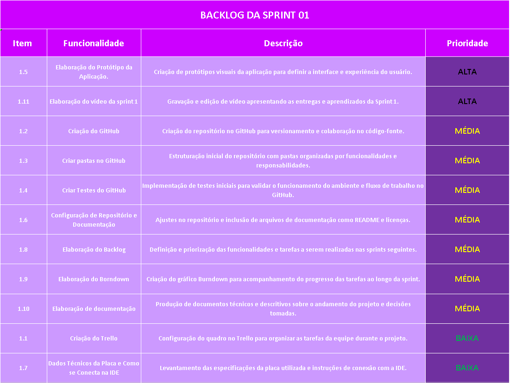
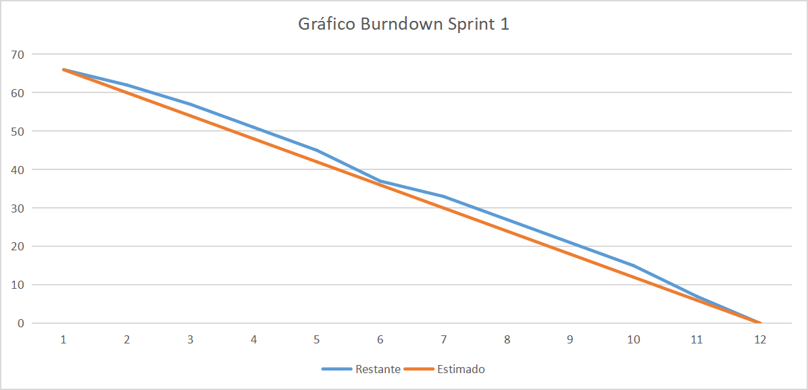
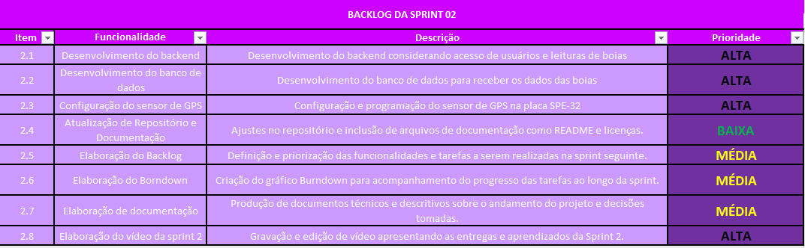
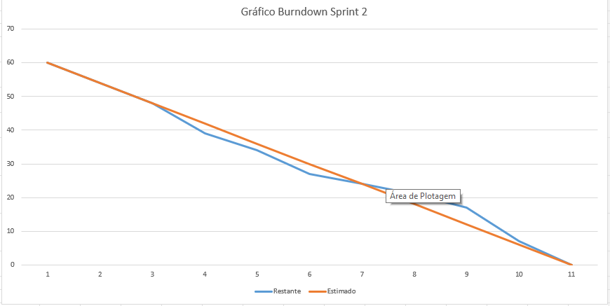
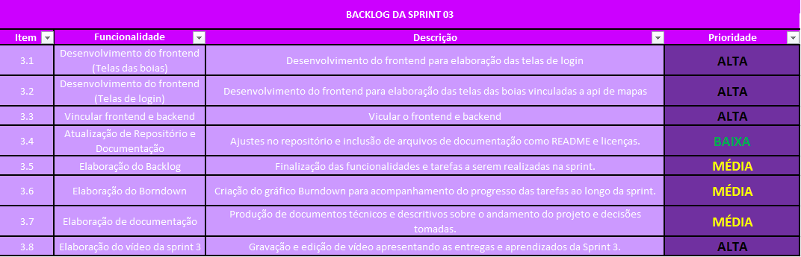
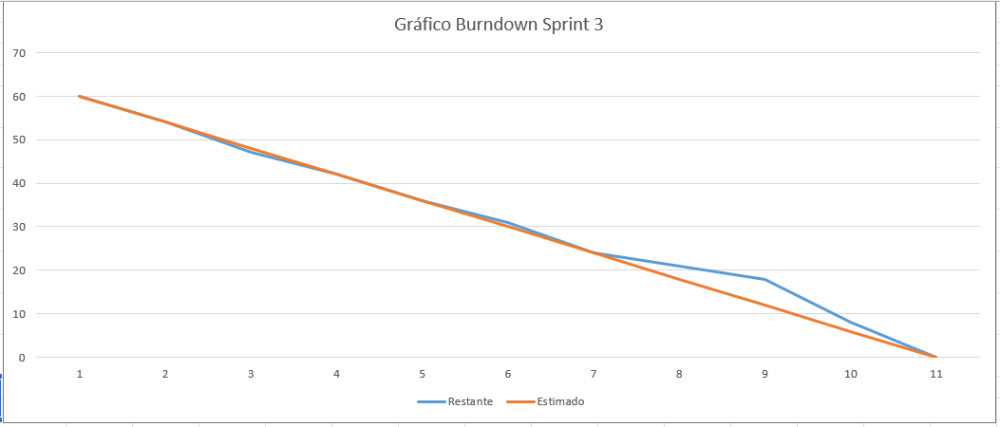

<div align="center">

# 🗺️ AZIMUTH 📱


</div>

## ℹ️ Sobre o Projeto

O ABP é um aplicativo móvel desenvolvido como projeto do 4º semestre da faculdade. Ele foi projetado para transmitir, receber, armazenar e visualizar dados de localização de derivadores de maneira eficiente e intuitiva, oferecendo praticidade e facilidade de uso diretamente no celular.

## ⚙️ Como rodar

O aplicativo ainda está em desenvolvimento, para rodar a aplicação localmente siga os seguintes passos:

1. Clone o repositório no seu dispositivo.

```
git clone https://github.com/jacksonrcmachado/AZIMUTH.git
```

Agora abra dois terminais diferentes e execute o frontend e o backend da aplicação.

### Frontend

2. Baixe as dependencias.

```
cd front
npm install
```

3. Execute o comando:

```
npm start
```

4. Leia o QRCode que aparecera no terminal utilizando o aplicativo Expo Go.

### Backend

2. Baixe as dependencias.

```
cd backend
npm install
```

3. Execute o comando:

```
npm start
```

4. A aplicação será executada na porta 3000.

## Documentação

Confira abaixo a documentação completa do projeto, que inclui informações detalhadas sobre a aplicação, a equipe de desenvolvimento e todo o processo de criação e evolução do projeto. Aqui você encontrará detalhes sobre funcionalidades, objetivos, tecnologias utilizadas, bem como a estrutura e o papel de cada integrante da equipe ao longo do desenvolvimento.

### Informações da Aplicação

> [Veja aqui as informações sobre a aplicação.](https://github.com/jacksonrcmachado/AZIMUTH/wiki)

### Informações de Desenvolvimento

> [Veja as informações sobre o desenvolvimento do projeto.](https://github.com/jacksonrcmachado/AZIMUTH/wiki/dev)

### Melhorias e Adequações
> [🧩 Possíveis Melhorias e Adequações para Atender o Cliente](documentation/MelhoriasCliente.md)


<br>

## Backlog Sprint 01
<br>



<br>

## Burndown Sprint 01
<br>



<br>

## Backlog Sprint 02
<br>



<br>

## Burndown Sprint 02
<br>



<br>

## Backlog Sprint 03
<br>



<br>

## Burndown Sprint 03
<br>



<br>
<hr>

<div align="center">

Projeto de ABP do 4º Semestre na Fatec de Jacareí - 2025.1

</div>
